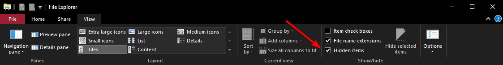

# Discord Quote Factory

Utility to rewrite Discord startup quotes. The code isn't much really, it was supposed to be a Qt exercise.

## How it works
1. Parse the json in your Discord AppData(or the Linux equivalent, unsetting the readonly option if necessary.
2. User makes changes, program saves the file as readonly (so Discord can't overwrite it)
3. ???
4. Profit

## How do I edit the quotes?
Just double click the items in the list.

## How should I use this application?
First, press the `...` button - or enter a file path in the textbox to the left of it.
Enter the `quotes.json` file located in your Discord folder - [See how do I find my Discord folder?](#wheres-my-discord-folder)

## Where's my Discord folder?
- YOUR_USERNAME: your username on Windows.
- DISCORD_RELEASE: your Discord installation identifier(see below)

| Name    | Identifier |
| ---     | ---       |
| Discord | discord |
| Discord PTB | discordptb |
| Discord Canary | discordcanary |

### For Windows users:
Make sure that in the Windows Explorer hidden files are enabled - [See how do I see hidden items in Windows Explorer?](#viewing-hidden-items-in-windows-explorer)
Usually located in `C:\Users\*YOUR_USERNAME*\AppData\*DISCORD_RELEASE*\quotes.json`
### For Linux users:
Usually located in `~/.config/*DISCORD_RELEASE*/quotes.json`
If you are using FlatPak, snap or similar, you're on your own. Good luck.

## Viewing hidden items in Windows Explorer
Just click the View tab and check `Hidden items`.

## Why this?
Why not? It was a Qt exercise.
